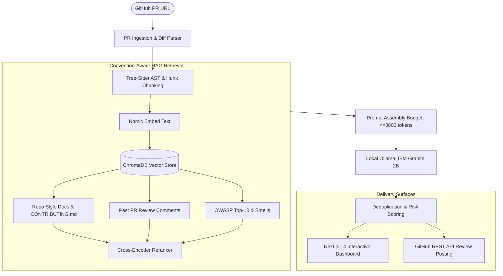

# 🔬 PRISM — Precision Review Intelligence & Style Mentor
### *Intelligent Code Review & Quality Coach for GitHub Pull Requests*
**Built for the IBM Bob 2.0 Hackathon (September 2026)**

---

[](https://fastapi.tiangolo.com)
[](https://nextjs.org)
[](https://ollama.com)
[](https://www.trychroma.com)
[-blueviolet)](https://modelcontextprotocol.io)
[](https://opensource.org/licenses/MIT)

---

## 📌 1. Overview & Problem Statement

Code reviews are a major bottleneck in modern software engineering:
* Senior engineers spend countless hours catching the same security flaws, null-pointer risks, and style deviations repeatedly.
* PR authors wait days for actionable feedback, slowing down cycle times.
* Existing AI review tools act like generic linters with an LLM wrapper, outputting vague advice like *"Consider adding null checks here"*.

### The PRISM Solution
**PRISM** is an autonomous **Quality Coach** that delivers line-anchored, convention-aware pull request reviews. Instead of generic LLM opinions, PRISM grounds its feedback in the target repository's **actual conventions** (`CONTRIBUTING.md`, style guides) and **past merged PR review history** using Retrieval-Augmented Generation (RAG).

> **Example PRISM Feedback:**  
> *"This project's `CONTRIBUTING.md §1.1` strictly prohibits raw SQL interpolation. Similar feedback was flagged in PR #1. Use parameterized queries: `db.execute(query, (user_id, username))`."*

---

## 🚀 2. Key Features

1. **Intelligent PR Ingestion & Unified Diff Parsing**:
   * Ingests any GitHub PR URL (or repo + branch).
   * Extracts changed files, full-file context windows (±30 surrounding lines), and AST nodes.

2. **Convention-Aware RAG Pipeline**:
   * Uses **ChromaDB** with cosine similarity and a **Cross-Encoder Reranker** (`ms-marco-MiniLM-L-6-v2`).
   * 6 dedicated collections: `style_{slug}`, `history_{slug}`, `source_{slug}`, plus global cold-start knowledge (`cold_start_owasp`, `cold_start_smells`, `cold_start_reviews`).

3. **Severity-Tagged Line Annotations**:
   * Categorizes findings into **Blocker**, **Major**, **Minor**, or **Nit** across **Security**, **Logic**, **Maintainability**, **Style**, and **Tests**.
   * Includes language-syntax-highlighted suggested fix blocks and authoritative citations.

4. **Executive PR Summary & Risk Scoring**:
   * Auto-generates a one-paragraph summary of what the PR changes and a bullet list of key risks.
   * Calculates a weighted risk score ($0–100$) rendered as an interactive circular gauge.

5. **Live GitHub PR Review Comment Posting (Phase 8)**:
   * Submits all findings as a formal GitHub Pull Request review in a single atomic batch call (`POST /repos/{owner}/{repo}/pulls/{number}/reviews`).
   * **Diff Position Mapper & Line Snapping**: Automatically clamps line numbers to valid diff hunks, preventing GitHub `HTTP 422` errors.

6. **Safety Gate & Incremental Learning**:
   * **Safety Gate**: Restricts live review posting (`dry_run: false`) to the designated demo repository (`DEMO_REPO_OWNER/DEMO_REPO_NAME` in `.env`), preventing accidental posts to external public repositories.
   * **Incremental Learning**: Automatically indexes posted review comments back into ChromaDB repo history in the background.

---

## 🏗️ 3. Architecture & Data Flow



---

## 🛠️ 4. Tech Stack

| Layer | Technology | Purpose |
| :--- | :--- | :--- |
| **LLM Generation** | **IBM Granite 2B** (`granite3-dense:2b`) | 100% private, local inference via Ollama for diff analysis |
| **Embeddings** | **Nomic Embed Text** (`nomic-embed-text`) | 768-dimensional local vector embeddings |
| **Vector Database** | **ChromaDB** | Local persistent cosine vector store |
| **Reranker** | **Sentence-Transformers** (`ms-marco-MiniLM-L-6-v2`) | Cross-encoder contextual relevance ranking |
| **AST Parsing** | **Tree-Sitter** | Language-aware syntactic hunk chunking (Python, TS, JS, Java, Go) |
| **Backend API** | **FastAPI + Uvicorn** | High-performance asynchronous REST API & Session Store |
| **Frontend** | **Next.js 14 (App Router) + TypeScript** | Dark-mode dashboard with interactive diff viewer |
| **Protocol** | **Model Context Protocol (MCP)** | Standardized tool interface (`prism_analyze_pr`, `prism_post_review`, etc.) |

---

## ⚙️ 5. Project Layout

```text
BOB-2.0/
├── backend/                  # FastAPI REST API
│   ├── main.py               # API entry point & CORS configuration
│   ├── session_store.py      # In-memory & pre-seeded review session store
│   └── routers/              # Endpoints for review, corpus, and health
├── frontend/                 # Next.js 14 Web Dashboard
│   ├── app/                  # App Router pages (Dashboard & Review Details)
│   ├── components/           # UI Components (DiffViewer, RiskScore, PostModal)
│   └── lib/                  # API client & TypeScript interfaces
├── prism_mcp/                # Core PRISM Engine & MCP Server
│   ├── server.py             # Model Context Protocol stdio server
│   ├── core/                 # Pipeline, Ollama client, Prompt builder, Findings
│   ├── rag/                  # Chunker, Embedder, ChromaDB wrapper, Reranker
│   ├── tools/                # analyze_pr, build_corpus, post_review, health
│   └── utils/                # Diff parser, Diff position mapper, Token counter
├── scripts/                  # Verification & test scripts (Phases 1-9)
│   ├── health_check.py       # Full system dependency validator
│   ├── setup_cold_start.py   # Populates cold-start OWASP/Smells knowledge
│   └── test_phase8.py        # Validates live GitHub comment posting & safety gate
├── CONTRIBUTING.md           # Repository conventions used for RAG grounding demo
├── DEMO_SCRIPT.md            # Step-by-step judge presentation walkthrough
└── requirements.txt          # Python dependencies
```

---

## 🏁 6. Quickstart & Local Setup

### Prerequisites
* **Python 3.11+**
* **Node.js 18+** & `npm`
* **Ollama** installed locally ([ollama.com](https://ollama.com))

### Step 1: Pull Ollama Models
```bash
ollama pull granite3-dense:2b
ollama pull nomic-embed-text
```

### Step 2: Python Environment Setup
```bash
python -m venv .venv
# On Windows:
.\.venv\Scripts\activate
# On Linux/macOS:
source .venv/bin/activate

pip install -r requirements.txt
```

### Step 3: Configure Environment Variables
Copy `.env.example` to `.env` and fill in your free GitHub Personal Access Token:
```env
GITHUB_TOKEN=ghp_your_token_here
DEMO_REPO_OWNER=DhruvPatel0110
DEMO_REPO_NAME=BOB_2.0-No_idea
OLLAMA_BASE_URL=http://localhost:11434
OLLAMA_MODEL=granite3-dense:2b
OLLAMA_EMBED_MODEL=nomic-embed-text
```

### Step 4: Initialize Cold-Start Vector Store
```bash
python scripts/setup_cold_start.py
```

### Step 5: Start the Backend & Frontend
**Terminal 1 (FastAPI Backend):**
```bash
.\.venv\Scripts\python.exe -m uvicorn backend.main:app --port 8000 --reload
```

**Terminal 2 (Next.js Frontend):**
```bash
cd frontend
npm install
npm run dev
```

Open your browser at **`http://localhost:3000`**.

---

## 🔌 7. Model Context Protocol (MCP) Tools

PRISM exposes standard MCP tools for integration into developer toolchains and AI agents:

| Tool | Parameters | Description |
| :--- | :--- | :--- |
| `prism_health_check` | `{}` | Verifies connectivity to Ollama, ChromaDB, and GitHub token |
| `prism_analyze_pr` | `pr_url`, `language_hint` | Executes the full review pipeline with convention grounding |
| `prism_build_corpus` | `owner`, `repo`, `force_rebuild` | Fetches and indexes repo style files & merged PR comments |
| `prism_retrieve_context`| `diff_hunk`, `file_path`, `repo_owner` | Retrieves top-k relevant RAG context chunks for a hunk |
| `prism_post_review` | `pr_url`, `findings`, `dry_run` | Atomically posts line-anchored review comments to GitHub |
| `prism_corpus_status` | `owner`, `repo` | Inspects ChromaDB collections, vector counts, and timestamps |

---

## 🎯 8. Live Demonstration (Judge Walkthrough)

For a fast, reliable demonstration to hackathon judges:

1. Open `http://localhost:3000`.
2. Click **`⚡ View Staged Demo PR`** to instantaneously load the pre-analyzed review for [PR #1](https://github.com/DhruvPatel0110/BOB_2.0-No_idea/pull/1).
3. Walk judges through the **Risk Score Gauge**, **Findings Breakdown**, and **Interactive Diff Viewer**.
4. Highlight the **Citations** (`CONTRIBUTING.md §1.1 | OWASP A03:2021`).
5. Click **"Post Review to GitHub"** $\to$ Uncheck Dry Run $\to$ Click **"Confirm & Post"** to show the live review appearing on GitHub in real time!

*See [`DEMO_SCRIPT.md`](DEMO_SCRIPT.md) for the full 60-second elevator pitch and Q&A answers.*

---

## 📄 License
This project is open-source under the [MIT License](LICENSE).
